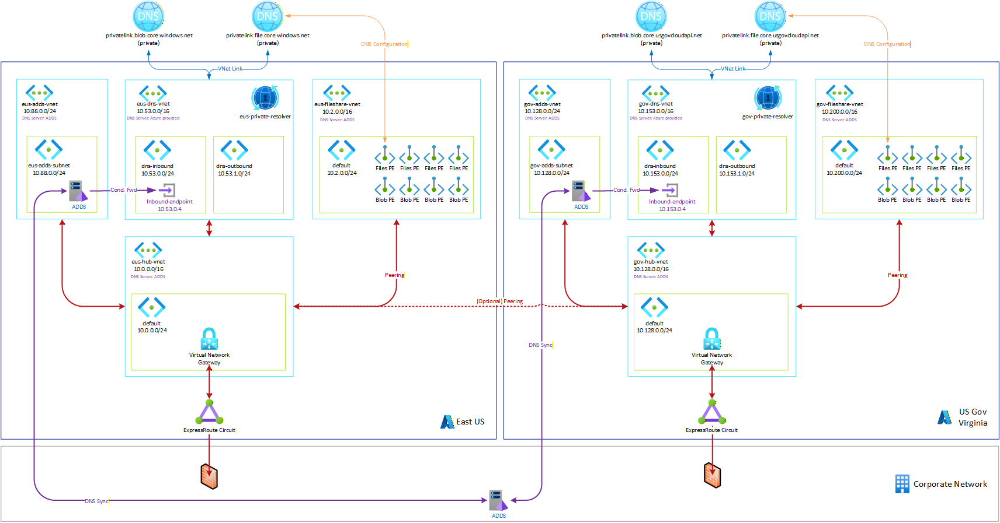

# Private Endpoints in US Government Cloud

Private Endpoints work the same way in US Government Cloud as they do in Commercial Azure Cloud. In fact they can be used together.

Your Gov Cloud infrastructure will be in a specific tenant and region, but it may have network connectivity to your on premises data center and or your commercial cloud infrastructure.

Additionally, Gov Cloud uses different FQDNs for PaaS services and their associated private endpoints. You can leverage both together as shown here:

> [!TIP]
> For complete list of Gov Cloud FQDNs, see the [Azure Government Private Endpoint DNS zones](https://learn.microsoft.com/en-us/azure/private-link/private-endpoint-dns#government).