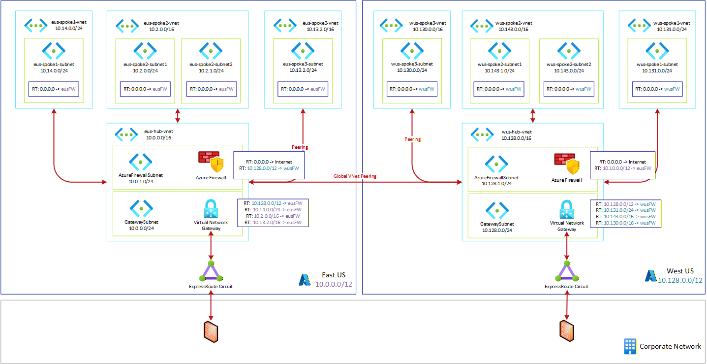

# Multi-region Secure Hub and Spoke Architecture

There are numerous architecture diagrams available that describe the Hub and Spoke architecture. But I haven't found a comprehensive introductory guide to routing with a Secure Hub and Spoke design.

Below is an architecture that shows how route tables should be configured for a two region secure hub and spoke network.

>[!NOTE]
> This diagram does not show all redundant paths from on premises to Azure. In reality you would likely have a bow-tie design to protect against Express Route outages in a given region.
>
>This diagram also does not cover routing rules between on premises and Azure. Its focus is primary on Azure configurations.

## IP Address Planning

Well planned out IP ranges for each region are essential for the success of a multi-region deployment. If you can keep an entire region within one contiguous CIDR range it will make route tables easier to manage.This likely should be a /16 or larger CIDR, but could be even be up to a /12. Larger than than and you run the risk of not being able to expand to additional regions and/or you will be conflicting with on premises IP ranges.

## Spoke Routing

Spoke routing is pretty easy, you set the default route to the IP address of the regional hub firewall. You do need to go touch each of the spokes, and that is no fun...but you can now use Network Manager to push a Routing configuration to all the spokes.

>[!NOTE]
> Depending upon how you configured your network peering, spoke networks will already be able to connect to the hub network and potentially the on premises network (and vice versa). However, with adding an Azure Firewall or other NVA spoke to spoke communication is not possible. Routing traffic through the firewall has the additional security benefits that come with your chosen solution.

## Firewall Routing

The hub network already knows the routes to the spoke, and that makes the firewall routing pretty easy as well. You will likely want a default route (0.0.0.0) pointing to the Internet.

The regional hub will already know routes to the other hub, but it will not know routes to the other hub's spokes. In addition, by default it won't send traffic through the other firewall. To solve this, you will add a summary route for the CIDR of the other region pointing to the other region's firewall.

If you do not have contiguous CIDR range in the other region, you must add each CIDR range at the highest level available. For example, you might need to add multiple /14s instead one /12.

## VNet Gateway Routing

The Gateway Subnet has the more problematic route tables. Luckily there aren't many of them in a typical architecture. This architecture works with both Express Route and Site-to-site VPN.

The rub here is that the GatewaySubnet already knows the routes to each of the local spokes as well as the other hub. Without a properly configured route table, it will bypass the firewall entirely. This also could lead to asymmetric routing because traffic one way will route through the firewall, but skip it going the other direction.

The solution is to put explicit routes for each local spoke to go to the firewall. You cannot use summarization routes in this case because routing will follow the most specific route (the one is already knows from peering). In addition, you should route the remote hub to the local firewall as well, to better control East-West traffic.

> [!TIP]
> For more information on hub and spoke routing, see [Use Azure Firewall to route a multi-hub and spoke topology](https://learn.microsoft.com/en-us/azure/firewall/firewall-multi-hub-spoke).