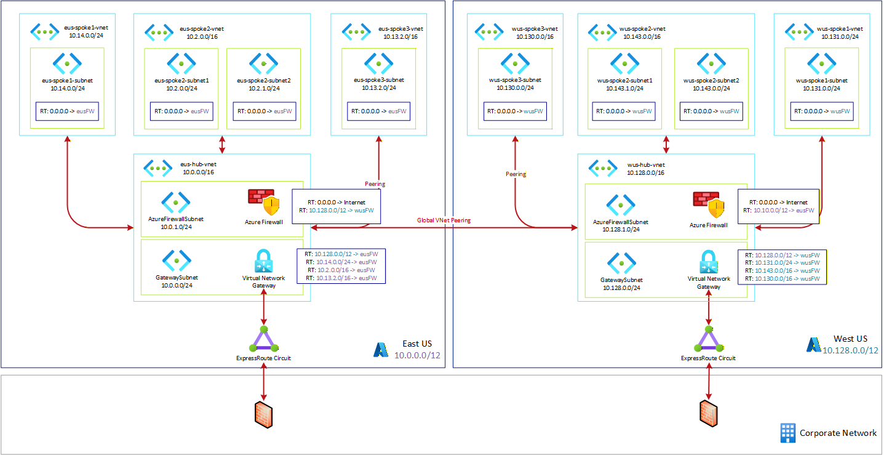

# Multi-region Secure Hub and Spoke Architecture

There are numerous architecture diagrams available that describe the Hub and Spoke architecture. But I haven't found a comprehensive introductory guide to routing with a Secure Hub and Spoke design.

Below is an architecture that shows how route tables should be configured for a two region secure hub and spoke network.

>[!NOTE]
> This diagram does not show all redundant paths from on premises to Azure. In reality you would likely have a bow-tie design to protect against Express Route outages in a given region.
>
>This diagram also does not cover routing rules between on premises and Azure. Its focus is primary on Azure configurations.

## IP Address Planning

Well-planned IP ranges for each region are essential for the success of a multi-region deployment. If you can keep an entire region within a single contiguous CIDR range, route tables become much easier to manage. That range should typically be a /16 or larger, and could go up to a /12. Any larger than that and you risk not being able to expand to additional regions, or conflicting with on-premises IP ranges.

## Spoke Routing

Spoke routing is straightforward: set the default route (0.0.0.0/0) to the IP address of the regional hub firewall. You do need to touch each spoke, which is no fun—but you can now use Azure Virtual Network Manager to push a routing configuration to all spokes at once.

>[!NOTE]
> Depending upon how you configured your network peering, spoke networks will already be able to connect to the hub network and potentially the on premises network (and vice versa). However, without adding an Azure Firewall or other NVA spoke to spoke communication is not possible. Routing traffic through the firewall has the additional security benefits that come with your chosen solution.

## Firewall Routing

The hub network already knows routes to its local spokes, which makes firewall routing fairly simple. You'll typically want a default route (0.0.0.0/0) pointing to the Internet.

The regional hub already knows the route to the other hub, but it does *not* know routes to the other hub's spokes—and by default it won't send traffic through the other firewall. To solve this, add a summary route for the CIDR of the other region pointing to the other region's firewall.

If the other region does not use a contiguous CIDR range, add each CIDR range at the highest level of summarization available. For example, you may need to add multiple /14s instead of a single /12.

## VNet Gateway Routing

The GatewaySubnet has the trickiest route tables, but luckily there aren't many of them in a typical architecture. This pattern works for both ExpressRoute and Site-to-Site VPN.

The catch is that the GatewaySubnet already knows routes to each local spoke and to the other hub via peering. Without a properly configured route table, it will bypass the firewall entirely. This can also lead to asymmetric routing—traffic in one direction goes through the firewall, while the return path skips it.

The solution is to add explicit routes for each local spoke that point to the firewall. You cannot use summary routes here, because routing always follows the most specific route (the one the GatewaySubnet already learned from peering). You should also route the remote hub through the local firewall to better control East-West traffic.

> [!TIP]
> For more information on hub and spoke routing, see [Use Azure Firewall to route a multi-hub and spoke topology](https://learn.microsoft.com/en-us/azure/firewall/firewall-multi-hub-spoke).
