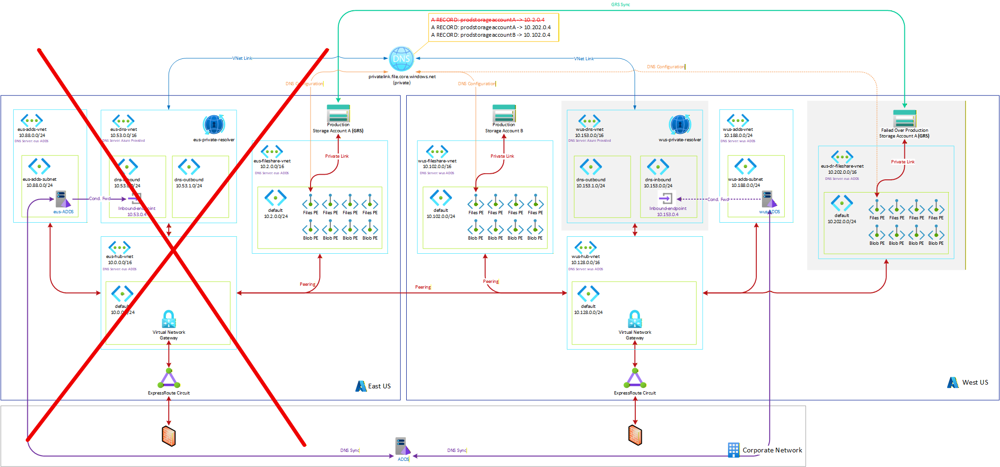

# Private Endpoint Disaster Recovery

Private endpoints connect PaaS services to your VNet. Many PaaS services have Disaster Recovery capabilities built into them so that they are not strictly region bound--you can failover to a secondary region. VNets, and by extension Private Endpoints are region bound. Adding Private Endpoints to a service can reduce diaster recoverability if not planned for. Each Private Link-able service has different disaster recovery capabilities, and thus your DR plan for each may vary.

## General Guidance

- Azure Private DNS zones are global resources and generally do not need to be created as part of diaster recovery.
- You cannot have two active (from a DNS perspective) private endpoints for the same service at one time.
- You must have a VNet in the recovery region on which to land the recovery private endpoint
- You must have a working DNS solution (like Azure DNS Private Resolver) in the recovery region
- You can choose how much of the recovery infrastructure is pre-built as passive infrastructure vs to-be built (hopefully through automation/infrastructure as code).

## Service Specific Guidance

### Azure SQL

Azure SQL has one of the best Diaster Recovery stories in Azure. By leveraging active geo-replication and failover groups, you can have a global endpoint that can failover to a secondary region gracefully without the need to modify connection strings.

What truly makes geo-replication unique from a private endpoint perspective, is that by design both the primary and secondary (read-only) can be active at the same time. Thus, (contrary to what I stated above) you CAN actually have both private endpoints up and in use (one is read-only) at the same time.

In the event of a failover, public DNS record for the failover group will swap to point to the newly promoted primary endpoint and your diaster region private endpoint will be immediately be available and service read/write operations.

>[!TIP]
> This blog post describes this process in great detail. https://blog.hompus.nl/2021/04/27/using-private-link-with-a-failover-group-for-azure-sql-database/

>[!TIP]
>For more information about Azure SQL Active Geo-replication, see [Active geo-replication](https://learn.microsoft.com/en-us/azure/azure-sql/database/active-geo-replication-overview?view=azuresql&tabs=tsql)  
>For more information about Azure SQL Failover Groups, see [Failover groups overview & best practices](https://learn.microsoft.com/en-us/azure/azure-sql/database/failover-group-sql-db?view=azuresql)

If you choose not to use active geo-replication and failover groups, you will need to configure the disaster recovery private endpoint as part of your DR plan.

### Azure Storage Accounts

Similar to Azure SQL active geo-replication, Storage accounts provide diaster recovery capabilities as well through GRS, RA-GRS, GZRS, and RA-GZRS. You can create private endpoints to both the primary and secondary (read-only) endpoints.

Unfortunately without the abstraction layer of failover groups, the failover does not allow the the secondary private endpoint to service requests to the newly promoted primary endpoint. The original private endpoint connects to the newly promoted primary endpoint in the secondary region. This type of failover WILL preserve capability for a service level outage in the primary region, but does not gracefully fail over in the event of a complete outage in the primary region.

To protect against a complete region failure, you must follow the general guidance above. You can see below that in the event of a total regional outage, **productionstorageaccountA**, its private endpoint, and the primary private resolver all become unavailable.

**ProductionstorageaccountA** can be failed over to the secondary region and the public endpoint will be available (if enabled). As part of disaster recovery (represented as dotted lines) you must link the disaster recovery private endpoint to the existing private DNS zone. You must also alter the conditional forwarder to send requests to the disaster recovery private resolver. 

**ProductionstorageaccountB** continues to function normally, except that the primary private resolver is unavailable. Once conditional forwarding is updated, the private endpoint will function normally without any changes directly to it.

>[!NOTE]
> The red lines represent network routing. The other colored lines represent configurations, not network paths.

Alternatively, there is an option to have a second Private DNS zone pre-created with the disaster recovery private endpoint already configured. This allows you to failover the private endpoints by simply altering the conditional forwarding rule. However, I generally do not recommend this because:
- Other non-DR private endpoints that live in the DR region may need to be reconfigured.
- Private endpoints in other regions not affected by the DR could inadvertently be impacted by cutting over to a new private DNS zone.
- There is more likely to be confusion where current authoritative DNS records reside.

>[!TIP]
>For more information about Storage Account failover, see [Failover considerations for storage accounts with private endpoints](https://learn.microsoft.com/en-us/azure/storage/common/storage-failover-private-endpoints)

### Key Vault

Azure Key Vault does not currently offer customer managed geo-redundancy. Microsoft does maintain failover capability in the event of a non-recoverable region outage. The timing of this failover is at the discretion of Microsoft. To ensure that Key Vaults (and their associated private endpoints) are able to meet customer defined SLAs, a secondary key vault must be maintained in the DR region.

Synchronization of these keys, secretes, and certificates between key vaults is NOT automatic. Given that a DR key vault would be maintained, private endpoints to the DR key vault will not conflict with the production key vault and both private endpoints can co-exist. In the event of a DR, application configuration changes may be required to access the DR key vault.

>[!TIP]
>For more information about key vault resiliency, see [Reliability in Key Vault](https://learn.microsoft.com/en-us/azure/reliability/reliability-key-vault)

### Azure Managed Redis

Similar to Azure SQL and Storage Accounts, Azure Managed Redis has the ability to mirror data to a secondary region. Redis, however, supports an active-active setup where you can read and write to either copy. Each copy is an independent Azure resource, and each can have its own Private Endpoint.

This allows you to stand up both private endpoints at the same time (similar to Key Vault). Synchronization of data between each cache is automatic and the data in the secondary region is immediately accessible.

Also similar to Key Vault, your calling client application must be able to switch to call the other private endpoint.

Azure Managed Redis does support an active-active configuration front-ended by a public load balancer. You may be able to achieve similar with a non-Azure internal load balancer and private endpoints. You cannot achieve this with an Azure internal load balancer because:
- Azure Internal Load Balancers do not support private endpoints in the back end pool
- Azure Internal Load Balancers are a regional resources, Azure does not currently offer an global internal load balancer.

>[!TIP]
>For more information about Azure Managed Redis, see [Configure active geo-replication for Azure Managed Redis instances](https://learn.microsoft.com/en-us/azure/redis/how-to-active-geo-replication)